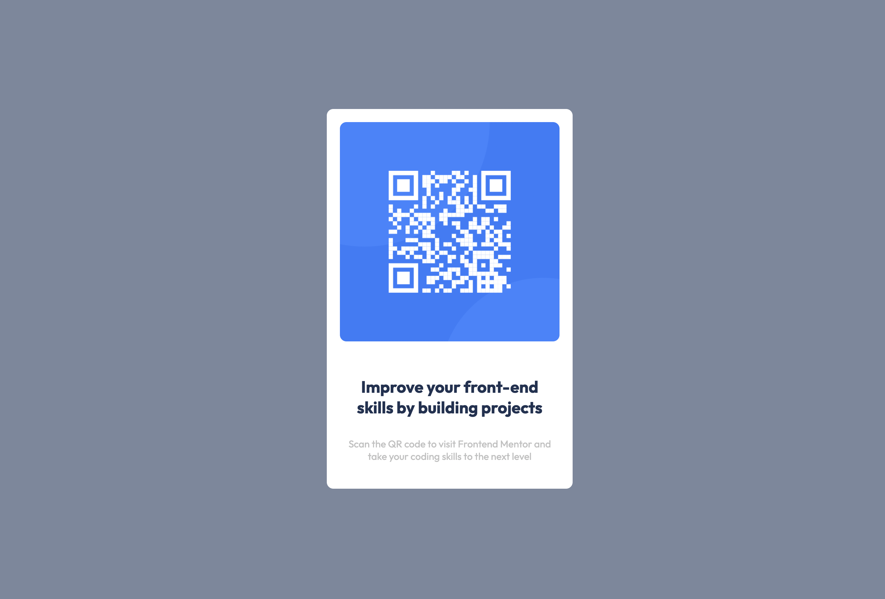

# Frontend Mentor - QR code component solution

This is a solution to the [QR code component challenge on Frontend Mentor](https://www.frontendmentor.io/challenges/qr-code-component-iux_sIO_H). Frontend Mentor challenges help you improve your coding skills by building realistic projects. 

## Table of contents

- [Overview](#overview)
  - [Screenshot](#screenshot)
  - [Links](#links)
- [My process](#my-process)
  - [Built with](#built-with)
  - [Continued development](#continued-development)
  - [Useful resources](#useful-resources)
- [Author](#author)


## Overview

### Screenshot




### Links

- Solution URL: [QR Code](https://niicode.github.io/qr-code-solution/)

## My process

### Built with

- Semantic HTML5 markup
- CSS custom properties
- Flexbox
- CSS Grid
- Mobile-first workflow
- Responsive design

### What I learned

I learnt how to use the html semantic markup to create a responsive QR code component. This is to help accessibility and make the QR code more accessible to users. And also the bem methodology in naming my classes.

To see how you can add code snippets, see below:

```html
<main>
  <section></section>
  <section></section>
</main>
```
```css
.bem-style__element {
  color: papayawhip;
}
```

### Useful resources

- [Mozilla Developer Network](https://developer.mozilla.org) - This helped me understand html semantic tags. I really liked this pattern and will use it going forward.

## Author

- Website - [Add your name here](https://www.your-site.com)
- Frontend Mentor - [@niicode](https://www.frontendmentor.io/profile/niicode)
- Twitter - [@_niicode](https://www.twitter.com/_niicode)
- GitHub - [@niicode](https://www.github.com/niicode)


